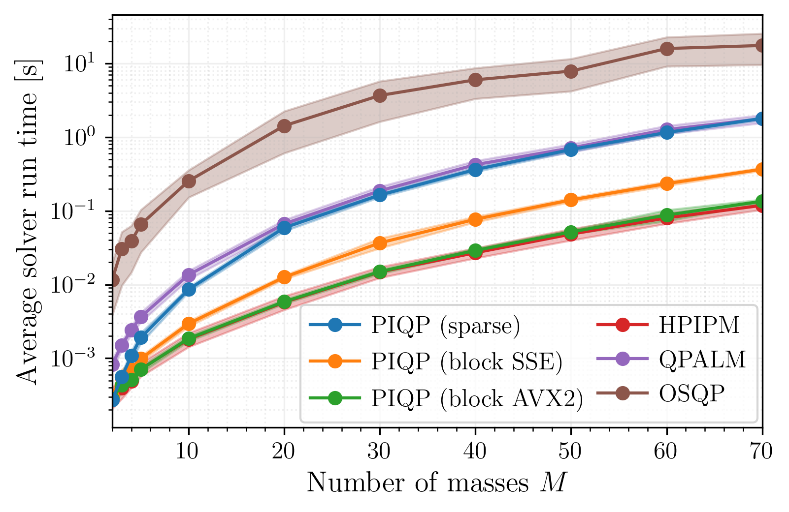
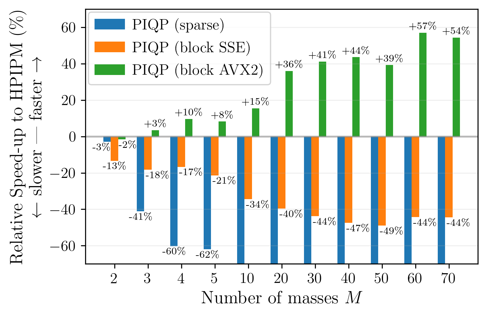
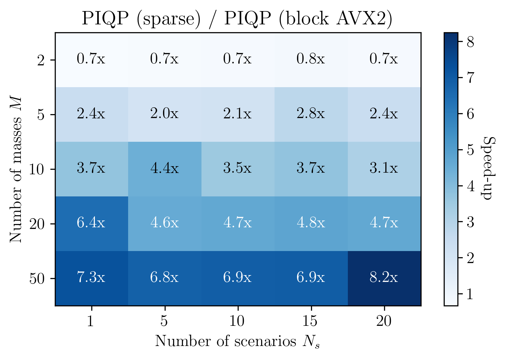

# PIQP Multistage Benchmarks

This repo contains the benchmarks for the paper "Exploiting Multistage Optimization Structure in Proximal Solvers".

We compare the following Quadratic Program (QP) solvers

-   PIQP
-   HPIPM
-   OSQP
-   QPALM

To reproduce the plots in the paper you can run the following script:
```shell
python run_benchmarks.py
```

### Results

<p align="center">
  
</p>

<p align="center">
  
</p>

<p align="center">
  
</p>

These results have been obtained on an  Intel Core i9 2.4 GHz CPU with Turbo Boost disabled.

## Citing

If you are using these benchmarks for your work, please cite the [PIQP paper](https://predict-epfl.github.io/piqp/citing).